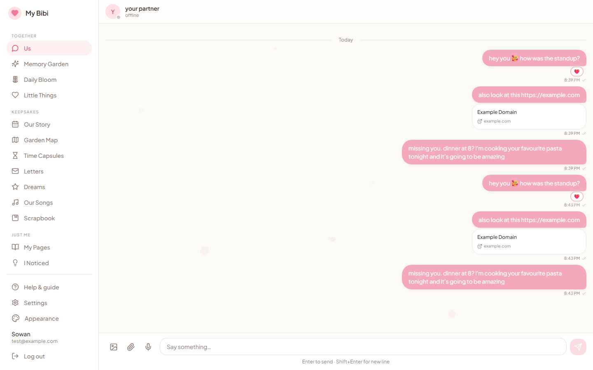
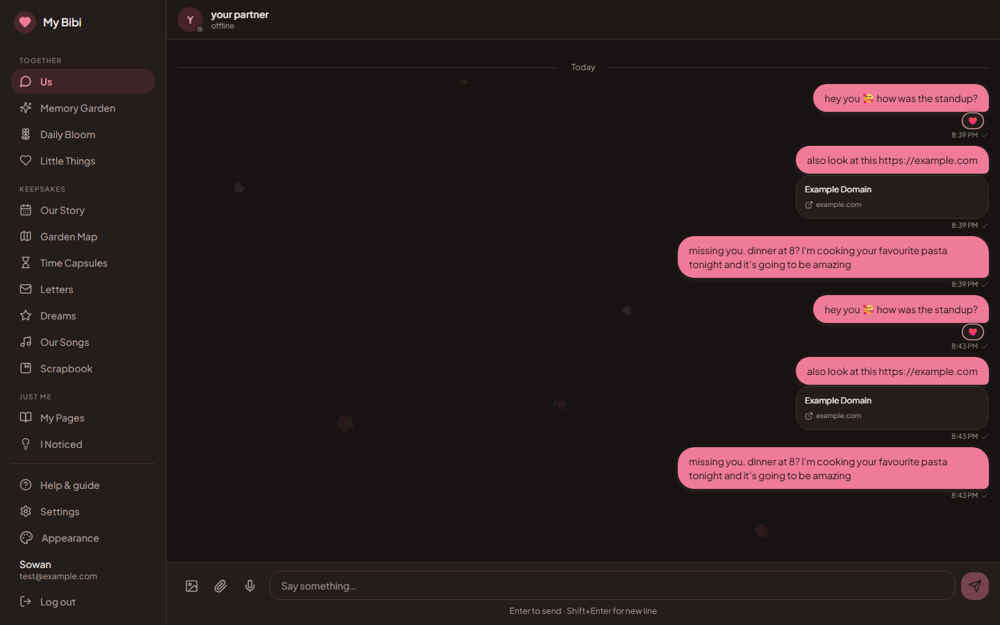
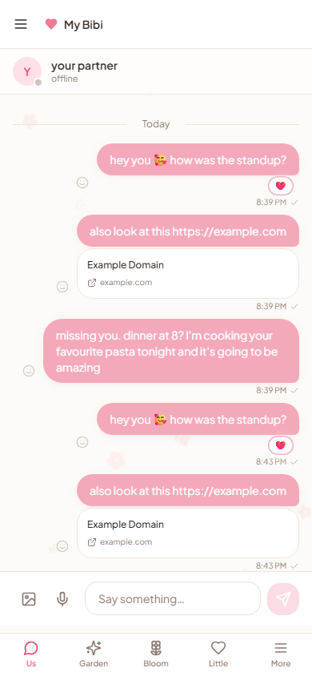
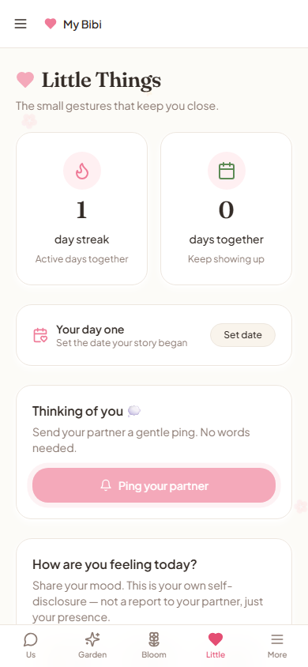
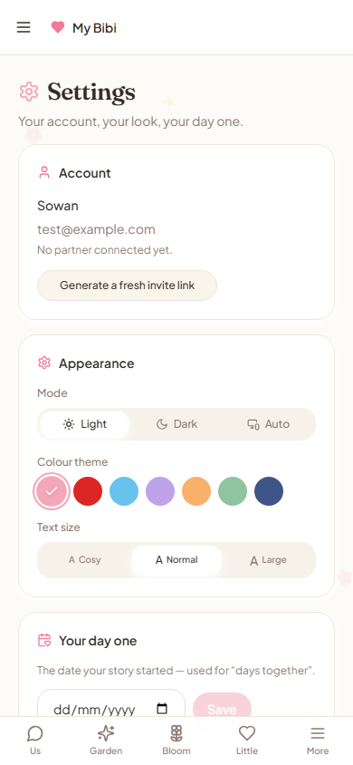
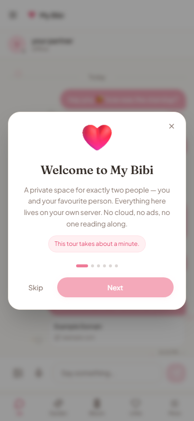
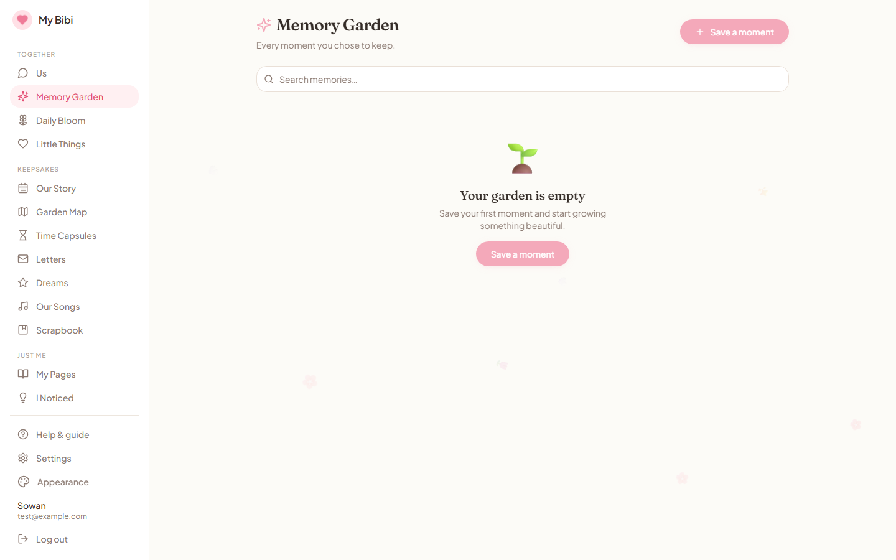
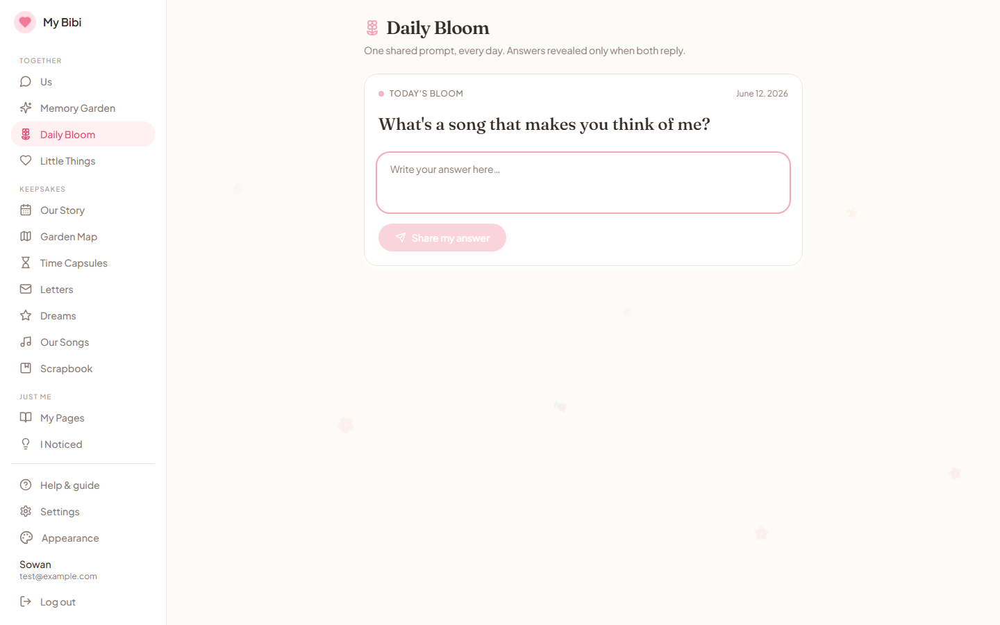

# My Bibi ❤️

**Your own private chat app — for exactly two people. Self-hosted, open source, free forever.**

## What is this?

My Bibi is a complete companion app for couples that you run on your own server: a private chat (texts, photos, voice notes, reactions, seen/delivered receipts), a shared memory garden, daily question rituals, time capsules, letters, a dreams board, your song playlist, encrypted private journals — the whole story of a relationship, in one place that belongs only to the two of you.

## Why does this exist?

**Because developers are bad at time, and good at servers.**

If you write code for a living, you know the feeling: the sprint ran long, the deploy broke, and the person you love got the leftovers of your attention — again. My Bibi is built to help with exactly that. It doesn't nag and it doesn't gamify your relationship; it gives you small, real rituals (a daily question, a thinking-of-you ping, a memory that resurfaces at the right moment) that make showing up easy even on busy days.

**And because you know where chat data goes.**

We're developers. We know how this industry works — the "free" messengers are paid for with data, and chat logs are exactly the kind of text that ends up training someone's model. The words between you and your partner are the most private text you will ever produce. They don't belong in anyone's training set.

So: host it yourself. One `docker compose up` on any cheap VPS or the old laptop in your closet, and you and your partner have a chat system where:

- **You control the data.** Every message, photo, and journal entry lives on *your* disk, as SQLite + human-readable markdown. Back it up with `tar`. Open it in Obsidian. It's yours.
- **Nobody else is in the room.** No third-party analytics, no telemetry, no cloud APIs touching message content. The AI features run on a local model (Ollama) on your own hardware.
- **It's genuinely impressive.** Let's be honest — "I built us our own private app" lands better than any subscription gift. Pick her favourite colour theme. Seal a time capsule for her birthday. She gets an app no one else in the world has.

**Open source, for everyone.** This project is public so any developer can clone it and set it up with their own credentials in minutes — your own secrets, your own server, your own two accounts, nobody else's. Fork it, theme it, make it yours.

> **"This app will never message your partner for you, never read your partner's mood for you, and never score your relationship. It remembers what you chose to keep, reminds you to show up, and stays out of the way. Your data lives on your server, in plain markdown, owned by both of you equally. We built the limits in on purpose. The limits are the point."**

---

## Screenshots

Real screenshots of the running app (not mockups).

### The chat — light & dark

| Light | Dark |
|---|---|
|  |  |

Online/offline presence, delivered ✓✓ and seen receipts, emoji reactions, link previews — and seven colour themes that work in both modes.

### Mobile-first

| Chat | Little Things | Settings | Onboarding |
|---|---|---|---|
|  |  |  |  |

### The rituals

| Memory Garden | Daily Bloom |
|---|---|
|  |  |

> The original pre-build design mockup is still at [docs/mockup.html](docs/mockup.html).

---

## Ethics Statement

My Bibi is designed with hard limits, not soft suggestions. These are not future roadmap items — they are implemented constraints baked into the API layer:

1. **No impersonation.** The AI never sends messages as either partner. Every message in the chat is written by a real human.
2. **The mirror principle.** AI insights about you go only to you. No mood flags, no "your partner seems distant" alerts. If the app observes person A and reports to person B, that feature is rejected.
3. **No cross-person surveillance.** No sentiment analysis of the other person's messages delivered to you.
4. **Private stays private.** Your journal is encrypted at rest. The person who runs the server cannot casually read your entries.
5. **Equal ownership.** Both partners have identical permissions. There is no superuser over the relationship data.
6. **Data never leaves the server.** No third-party analytics, no telemetry, no external APIs that receive your message content.

---

## Features

| Feature | Description |
|---|---|
| **Shared Chat (Us)** | Text, photos, voice notes, files, link previews — with online/offline presence, sent/delivered/seen ticks, and emoji reactions |
| **Memory Garden** | Save meaningful moments as markdown — searchable, browsable, yours forever |
| **Daily Bloom** | One shared prompt per day; answers revealed only after both respond |
| **Time Capsules** | Seal a message + photo until a future date — neither of you can open early |
| **Letters** | Slow messages with scheduled delivery — a quieter inbox alongside chat |
| **Future Dreams** | A shared board of goals with step milestones; achieved dreams join your timeline |
| **Our Songs** | The playlist of your story — official YouTube/Spotify embeds + the note behind each song |
| **Our Story (Timeline)** | Everything you kept, in chronological order — no AI, just your vault |
| **Garden Map** | Your whole story as an animated garden — every memory a flower, star, or note |
| **Monthly Scrapbook** | Auto-generated keepsake per month; export to PDF locally |
| **My Pages (Journal)** | Private per-person journal, **encrypted at rest** — the server owner can't read it |
| **Gift Vault** | Private encrypted wishlist (sizes, favourites) — invisible to your partner on purpose |
| **I Noticed** | Local AI reflects your *own* words back to you — never your partner's (mirror principle) |
| **Little Things** | Streak, days together, thinking-of-you ping, self-disclosed mood weather + heatmap |
| **Themes** | Light & dark mode, 7 colour themes (incl. Crimson ❤️ and Midnight), 3 text sizes |

---

## Tech Stack

| Layer | Technology | Why |
|---|---|---|
| Frontend | Next.js 14 (App Router), TypeScript | Modern SSR, great PWA support |
| Styling | Tailwind CSS, shadcn/ui | Fast, accessible, beautiful |
| Backend | FastAPI (Python 3.11) | Async, fast, clean |
| Database | SQLite + FTS5 | Zero ops, perfect for two users |
| Storage | Markdown vault (Obsidian-compatible) | Human-readable, no lock-in |
| AI | Ollama (local model — Phase 3) | Completely free, fully private |
| Auth | bcrypt + JWT + invite link | Simple, secure, no third parties |
| Deploy | Docker Compose | One command, self-hosted |

---

## Quick Start

### Prerequisites

- Docker and Docker Compose installed
- ~2 GB disk space (more if you add Ollama models)

### One-command setup

```bash
git clone https://github.com/yourusername/my-bibi-app.git
cd my-bibi-app
cp .env.example .env
# Edit .env — at minimum, change JWT_SECRET and INVITE_SECRET to long random strings
docker compose up -d
```

Then open `http://localhost:3000` in your browser.

### First-time setup

1. Go to `http://localhost:3000/setup` — create the first account (you)
2. Copy the invite link shown after setup
3. Send it to your partner — they visit it and create their account
4. Both of you log in and start chatting

That's it. No email verification, no third-party accounts, no cloud sign-in.

---

## Environment Variables

Copy `.env.example` to `.env` and fill in:

| Variable | Description | Default |
|---|---|---|
| `VAULT_PATH` | Where markdown files and SQLite DB are stored | `./vault` |
| `JWT_SECRET` | Secret for signing JWTs — **change this** | — |
| `JWT_EXPIRE_MINUTES` | JWT lifetime in minutes | `60` |
| `INVITE_SECRET` | Secret for signing invite tokens — **change this** | — |
| `BACKEND_URL` | Internal URL of FastAPI backend | `http://localhost:8000` |
| `FRONTEND_URL` | URL of Next.js frontend (used for CORS) | `http://localhost:3000` |
| `OLLAMA_BASE_URL` | Ollama service URL (Phase 3) | `http://ollama:11434` |
| `OLLAMA_MODEL` | Model name to use (Phase 3) | `llama3.2:3b` |

**Security note:** `JWT_SECRET` and `INVITE_SECRET` must be long, random strings. Generate them with:

```bash
openssl rand -hex 32
```

---

## Architecture

```
┌─────────────────────────────────────────────────────────────────────┐
│                         Your Server / PC                            │
│                                                                     │
│  ┌──────────────────┐    ┌──────────────────────────────────────┐   │
│  │  Next.js 14      │    │  FastAPI (Python 3.11)               │   │
│  │  Port 3000       │◄──►│  Port 8000                          │   │
│  │                  │    │                                      │   │
│  │  PWA             │    │  ┌────────────────────────────────┐  │   │
│  │  Tailwind CSS    │    │  │  Routers                       │  │   │
│  │  shadcn/ui       │    │  │  auth / chat / memory /        │  │   │
│  └──────────────────┘    │  │  bloom / journal / little_things│  │   │
│                          │  └────────────────────────────────┘  │   │
│                          │                                      │   │
│                          │  ┌────────────────┐ ┌────────────┐  │   │
│                          │  │ SQLite + FTS5  │ │  Markdown  │  │   │
│                          │  │ vault/db.sqlite│ │  Vault     │  │   │
│                          │  └────────────────┘ └────────────┘  │   │
│                          │                                      │   │
│                          │  vault/                              │   │
│                          │  ├── chat/                           │   │
│                          │  ├── media/                          │   │
│                          │  ├── memories/YYYY-MM/               │   │
│                          │  ├── journal/{user_id}/              │   │
│                          │  └── bloom/                          │   │
│                          └──────────────────────────────────────┘   │
│                                                                     │
│  ┌──────────────────┐                                               │
│  │  Ollama          │  (Phase 3 — optional)                         │
│  │  Port 11434      │                                               │
│  │  llama3.2:3b     │                                               │
│  └──────────────────┘                                               │
└─────────────────────────────────────────────────────────────────────┘

No data ever leaves this box. No external APIs. No telemetry.
```

---

## Self-Hosting Instructions

### On a home server or VPS

1. Clone the repo on your server
2. Copy and edit `.env`
3. Run `docker compose up -d`
4. Point your domain at port 3000 (use Nginx or Caddy as a reverse proxy)
5. Add HTTPS with Let's Encrypt (strongly recommended)

### Backup your data

Everything lives in the `vault/` directory. Back it up with:

```bash
# Simple backup
tar -czf bibi-backup-$(date +%Y%m%d).tar.gz vault/

# Or rsync to another location
rsync -av vault/ user@backup-server:/backups/bibi/
```

The vault contains:
- `db.sqlite` — all messages, memories, bloom answers, streaks
- `memories/` — markdown files for every memory
- `journal/` — per-user journal entries (encrypted in Phase 4)
- `media/` — photos and voice notes
- `bloom/` — daily bloom archive

### Vault Path Configuration

By default the vault lives at `./vault` relative to the docker-compose.yml. To move it:

```env
VAULT_PATH=/mnt/nas/my-bibi-vault
```

The vault is an Obsidian-compatible folder. You can open it in Obsidian for a beautiful read-only view of your memories and journals.

---

## Phases

> **Status:** Phases 1–4 are feature-complete. See `.claude/STATUS.md` for the live checklist and the remaining pre-release polish items.

### Phase 1 — Foundation ✅
- Two-user auth with invite link flow
- Vault path configuration
- Shared chat (text, photos, voice notes)
- Memory Garden (save + browse + search)

### Phase 2 — Rituals & Memory ✅
- Rich link previews, file sharing
- Daily Bloom ritual polish
- Milestones, streak, thinking-of-you ping
- **Mood Weather** — you pick your sky (☀️ ⛅ 🌧 ⛈ 🌙); stored in markdown; calendar heatmap; never inferred, never surveillance
- **Time Capsule** — lock a message + photos + voice note until a future date; neither partner can open early; confetti on unlock
- **On This Day** — date-math resurface of memories from the same day in past years; no AI required
- **Shared Playlist Memories** — save a song URL + a note + who shared it + why; renders official embed; never proxies audio
- **Letters** — deliberate delayed messages with scheduled delivery (tonight / tomorrow morning / custom); slower inbox alongside chat; markdown editor; beautiful paper UI
- **Relationship Timeline** — chronological story built from existing vault markdown; smooth scrolling; click opens the memory
- **Future Dreams board** — shared goals (visit Kyoto, first apartment, learn scuba); attach memories as you move toward them; completed dreams archive into the timeline

### Phase 3 — Local AI ✅
- Ollama integration (Llama 3.2 3B or Qwen 2.5 3B)
- Memory resurfacing nudges
- Own-journal self-reflection
- **"I noticed"** private self-reflection insights — analyses only *your* messages for recurring topics, unspoken gratitude, unfinished promises; output goes to you only; never cross-person; all LLM calls through `ai_service.py`
- Mirror principle enforced at every AI call; degrades gracefully if Ollama is offline

### Phase 4 — Privacy + Polish ✅
- Per-user journal encryption (key derived from password)
- **Gift Vault** — private per-user wishlist (wishes, ring sizes, favourites); encrypted; never visible to partner
- **Monthly Scrapbook** — auto-generated from vault: top photos + memories + blooms + milestones; rendered as magazine layout; PDF export; generated locally, no external services
- **Relationship Map** — visual garden where every memory is a flower/star/stone by type; timeline grows left-to-right; click opens the markdown note; canvas optimised for mobile
- PWA polish + service worker
- Docker Compose packaging
- Public release

---

## Contributing

My Bibi is open source. Contributions are welcome, with one constraint: **the ethical guardrails are non-negotiable.**

Pull requests that add cross-person surveillance, sentiment analysis of one partner delivered to the other, or any form of AI impersonation will be closed immediately, not because the idea is poorly implemented, but because the feature is the problem.

If you want to add AI features, read the Mirror Principle section in `CLAUDE.md` carefully first.

```bash
# Local development (without Docker)
# Backend
cd backend
python -m venv venv && source venv/bin/activate
pip install -r requirements.txt
cp ../.env.example ../.env  # Edit as needed
uvicorn main:app --reload

# Frontend (separate terminal)
cd frontend
npm install
npm run dev
```

---

## License

MIT License

Copyright (c) 2025 My Bibi Contributors

Permission is hereby granted, free of charge, to any person obtaining a copy of this software and associated documentation files (the "Software"), to deal in the Software without restriction, including without limitation the rights to use, copy, modify, merge, publish, distribute, sublicense, and/or sell copies of the Software, and to permit persons to whom the Software is furnished to do so, subject to the following conditions:

The above copyright notice and this permission notice shall be included in all copies or substantial portions of the Software.

THE SOFTWARE IS PROVIDED "AS IS", WITHOUT WARRANTY OF ANY KIND, EXPRESS OR IMPLIED, INCLUDING BUT NOT LIMITED TO THE WARRANTIES OF MERCHANTABILITY, FITNESS FOR A PARTICULAR PURPOSE AND NONINFRINGEMENT. IN NO EVENT SHALL THE AUTHORS OR COPYRIGHT HOLDERS BE LIABLE FOR ANY CLAIM, DAMAGES OR OTHER LIABILITY, WHETHER IN AN ACTION OF CONTRACT, TORT OR OTHERWISE, ARISING FROM, OUT OF OR IN CONNECTION WITH THE SOFTWARE OR THE USE OR OTHER DEALINGS IN THE SOFTWARE.

---
